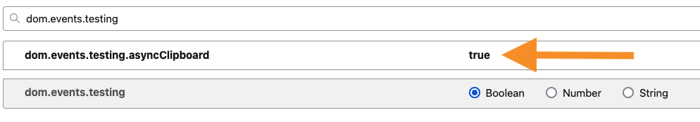
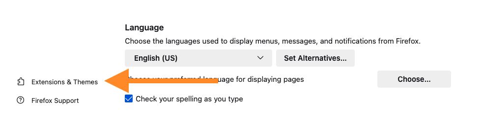
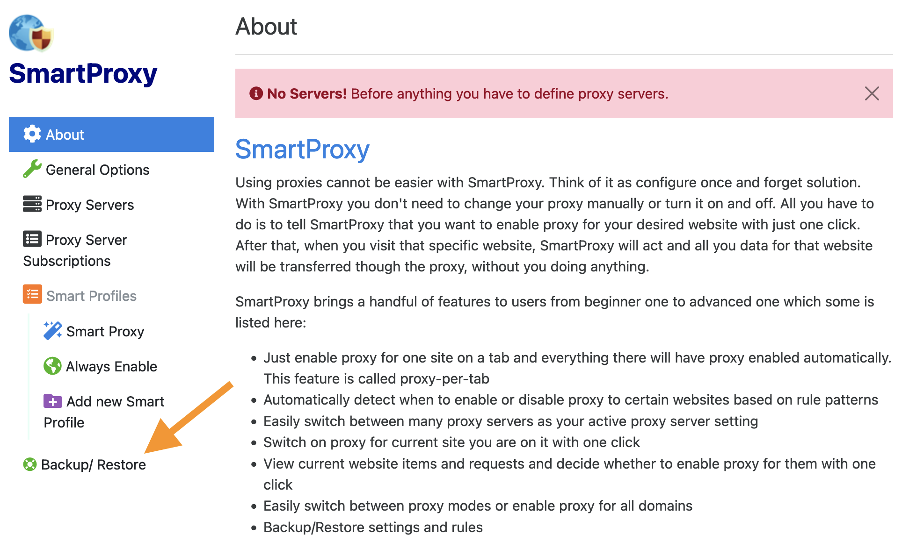
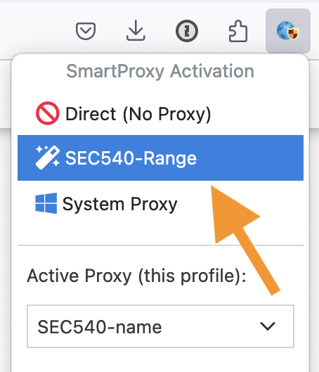

# Range Access Instructions (J01 / K01)

You must complete the following steps to connect to the DevOps Server.

## SANS Cloud Security Flight Simulator Access

Complete the following steps to install the Firefox web browser on your machine, add the SEC540 root certificate, and configure the SmartProxy for accessing the SANS Cloud Security Flight Simulator environment.

### Install Firefox

!!! warning "Firefox is Required!"

    You must use Firefox to connect to the SANS Cloud Security Flight Simulator environment. Chrome's SmartProxy extension does not support proxy authentication.

1. Download and install the Firefox web browser on your machine: [https://www.mozilla.org/firefox](https://www.mozilla.org/firefox){: target="_blank" rel="noopener" }.

1. The OpenVSCode server accessible through the SANS Cloud Security Flight Simulator requires the `dom.events.testing.asyncClipboard` option to be enabled to paste commands into the embedded OpenVSCode terminal. To set this option, browse to the `about:config` URL. Then, search for the `dom.events.testing.asyncClipboard` option and double click set it to `true`.

    {: class="w800"}

### Install SEC540 Root Certificate

For TLS secured connections to the server in the SANS Cloud Security Flight Simulator, download the SANS Cloud Security CA Certificate. Then, add the CA certificate to your browser's trusted list of certificate authorities.

1. Download the DER Encoded SEC540 certificate and note the download location: [https://sec540.com/ca](https://sec540.com/ca){:download="sec540-ca.der"}

- Open the Firefox settings by going to Firefox > Settings in the menu bar. Alternatively, you can browse to the `about:preferences` URL.

- Click "Privacy & Security" in the left hand menu and scroll down to the "Certificates" section.

    {: class="w800"}

- Click the **View Certificates** button.

- In the Certificate Manager window, select the **Authorities** tab, and click the **Import...** button.

    {: class="w800"}

- Browse to the directory that you downloaded the `sec540-ca.der` file and select the certificate.

- Select the *Trust this CA to identify websites* trust settings option and press **OK** to import the certificate.

    {: class="w800"}

- In the Certificate Manager window, press **OK** to close the certificate settings window.

    {: class="w800"}

### Install SmartProxy

The SANS Cloud Security Flight Simulator server(s) is accessible through a SOCK5 proxy listening on port 54000. Open Firefox and install the SmartProxy extension (<https://addons.mozilla.org/en-US/firefox/addon/smartproxy/>). If you are not familiar with Firefox extensions, follow the steps below to install the SmartProxy extension.

1. From the Firefox preferences screen, select the **Extensions & Themes** option in the left navigation menu. Alternatively, you can browse to the `about:addons` URL.

    {: class="w800"}

- Use the *Find more add-ons* field to search for the **SmartProxy** extension.

    {: class="w800"}

- Select the **SmartProxy** add-on to open to the SmartProxy installation page.

    {: class="w600"}

- Click the **Add to Firefox** button to start the installation.

    {: class="w800"}

- Click the **Add** button in the *Add SmartProxy?* popup window.

    {: class="w800"}

- Check the **Allow this extension to run in Private Windows** option.

    {: class="w800"}

- Click the **Okay** button to complete the installation.

- The SmartProxy extension is now installed and can be found in the top right-hand corner of the browser.

    {: class="w800"}

- By default, the extension is not pinned to menu bar. You can pin the extension by right clicking on the extension and selecting **Pin to Toolbar** for convenience.

    {: class="w300"}

### Import SmartProxy Configuration

1. In Firefox, select the SmartProxy extension and press the **Settings** button.

    {: class="w300"}

- In the SmartProxy Settings, select the **Backup/Restore** button.

    {: class="w800"}

- Select the **Restore Backup** button to import the SmartProxy configuration file.

    {: class="w800"}

- Browse to the directory that you ran Terraform from and select the SmartProxy configuration file.

- After restoring the backup, the **SEC540-Range** SmartProxy configuration is now available to use. All traffic to *sans.labs* and *dm.paper* will be sent through the SOCKS5 proxy to your DevOps server.

    {: class="w800"}

- Use the SmartProxy extension to select the **SEC540-Range** proxy.

    {: class="w300"}

- Firefox is now connected to the SANS Cloud Security Flight Simulator environment! All class-relevant traffic will be sent to your DevOps server.

- In Firefox, browse to the [Lab Instructions Workbook](https://workbook.sans.labs){: target="_blank" rel="noopener" } and [OpenVSCode Server](https://workbook.sans.labs){: target="_blank" rel="noopener" }.

- Run the following commands in the OpenVSCode terminal to update the lab instructions and apply any applicable errata patches.

    ```bash
    workbook-update
    virtual-machine-update
    ```
