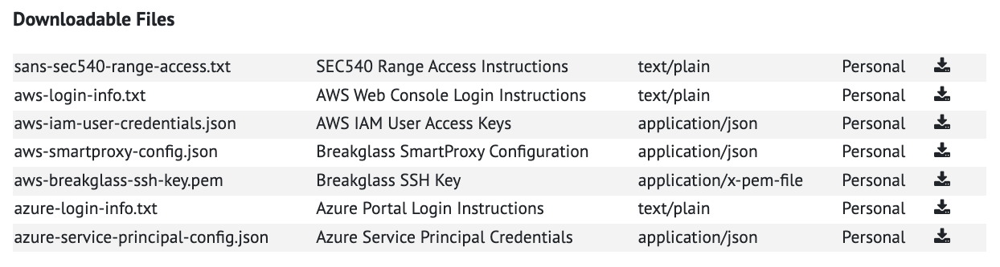
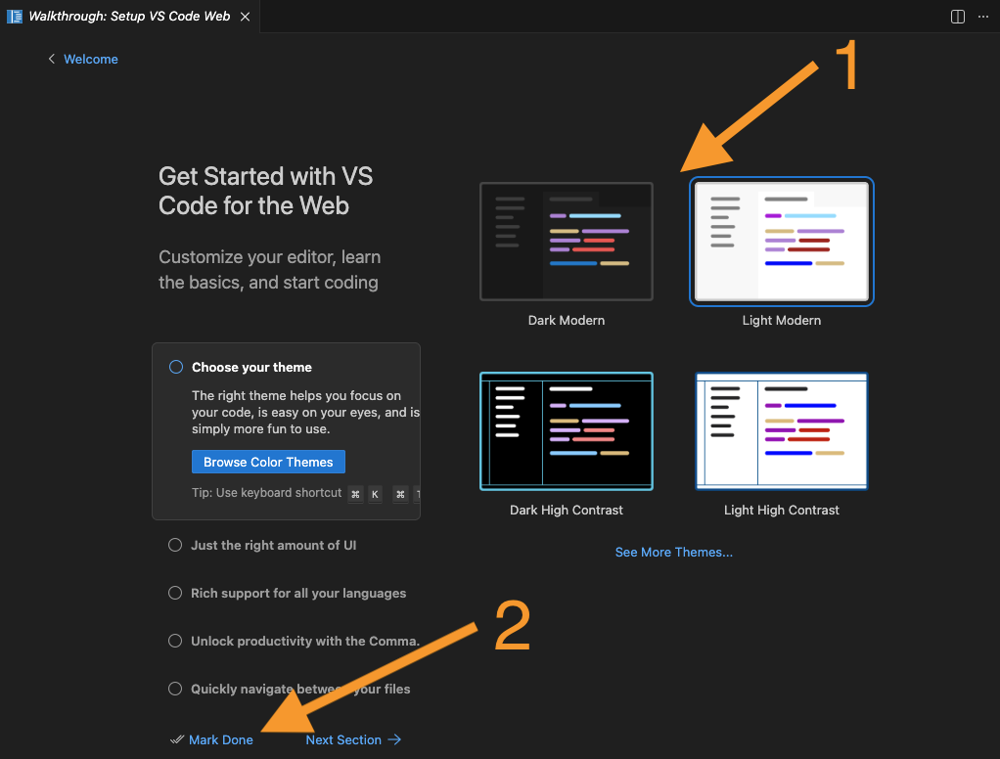

# SEC540 Lab Setup Guide (L01)

## Before You Arrive or Travel to Class

You must complete several steps before you arrive or travel to class.  For those students attending a live class event, this means completing the setup process before you arrive at the venue.

The following sections of this document cover these steps:

1. **Downloading Course Materials**: Follow the guidance at [https://sansurl.com/downloading-course-materials](https://sansurl.com/downloading-course-materials){: target="_blank" rel="noopener" } to access and download your course materials.
2. **SANS MyLabs Access**: Some materials for your course are dynamically generated. Follow the steps below to access this material in the MyLabs section of your sans.org account.
3. **Lab Range Provisioning**: Review the guidance below to launch the SEC540 lab environment range, and download your lab range configuration files.
4. **SANS Cloud Security Flight Simulator Access**: Follow the steps below to authenticate to the Cloud Security Flight Simulator and access the services running on the DevOps server.
5. **SEC540 Lab Instructions**: Follow the steps below to connect to the DevOps server, update the lab instructions, and apply the errata patches to ensure you are working from the most recent instructions available.
6. **SEC540 Cloud Configuration**: Follow the steps below to complete the relevant environment configuration for your selected cloud provider.

## 2. SANS MyLabs Access

To access the SANS Cloud Security Flight Simulator, sign in to [https://sans.org/account](https://sans.org/account){: target="_blank" rel="noopener" } and view the **My Labs** screen. Expand the **SEC540** section and read through the details. For step-by-step instructions, review the guidance on the SANS website at [https://sansurl.com/accessing-mylabs-content](https://sansurl.com/accessing-mylabs-content){: target="_blank" rel="noopener" }.

## 3. Lab Range Provisioning

!!! info "OnDemand Student Access"

    Students taking SEC540 OnDemand will see a dynamic provisioning option on their [SANS My Labs](https://connect.labs.sans.org/){: target="_blank" rel="noopener" } page. Students will need to press the **Launch** button to provision their lab range. After launching the simulator, the range configuration files will be available to download within 30 minutes.

!!! info "Live Students Access"

    Students taking SEC540 at a live event (in person or online) will automatically have their lab range provisioned 24 hours before the event starts. Before the class starts, browse to the [SANS My Labs](https://connect.labs.sans.org/){: target="_blank" rel="noopener" } page to download the range configuration files.

From the **My Labs** screen, scroll to the **Downloadable Files** table and locate the configuration files for your lab range.

{: class="w800"}

Download each of the following files and move them into a noted directory location on your host machine:

* *sans-sec540-range-access.txt* - (Required) The primary configuration file for your lab range that includes your unique range URL, expiration time, username, and password for authenticating to the SANS Cloud Security Flight Simulator. After authentication, you can browse and authenticate (if needed) to the other services hosted on the range's DevOps server including the lab instructions, OpenVSCode server, GitLab, Vault, Keycloak, Moonlight Monitoring, and Defect Dojo.

* *aws-login-info.txt* - (Required) Contains instructions for signing in to a time-limited SANS managed AWS account using the AWS Web Console.You will use this file during the lab setup if you choose to use the AWS cloud provider for the course.

* *aws-iam-user-credentials.json* - (Optional) Contains programmatic access credentials for configuring the DevOps server to authenticate to the SANS managed AWS account. These credentials have already been placed on the DevOps server in the *~/config/aws-config.json* file. You should not need to use this file, but keep it as a backup just in case you need to reconfigure the credentials at any point.

* *azure-login-info.txt* - (Required) Contains instructions for signing in to a time-limited SANS managed Azure subscription using the Azure Web portal. You will use this file during the lab setup if you choose to use the Azure cloud provider for the course.

* *azure-service-principal-config.json* - (Optional) Contains programmatic service principal credentials for configuring the DevOps server to authenticate to the SANS managed Azure subscription. These credentials have already been placed on the DevOps server in the *~/config/azure-config.json* file. You should not need to use this file, but keep it as a backup just in case you need to reconfigure the credentials at any point.

## 4. SANS Cloud Security Flight Simulator Access

Open the *sans-sec540-range-access.txt* configuration file you downloaded in the previous section. Find the SEC540 Range Access Instructions at the top of the file, which includes the Range URL, Username, Password, and Expiration.

!!! abstract "Example SEC540 Range Access Instructions"

    ```plain
    SEC540 Range Access Instructions

    Your SEC540 Lab Range is hosted on the unique-identifier.domain.tld domain.
    To access the range services, you need to authenticate to the range with the
    following credentials:

    Range URL: https://range.unique-identifier.domain.tld
    Range Username: range-unique-identifier
    Range Password: unique-range-password
    Range Expiration: end date and time
    ```

When accessing the Cloud Security Flight Simulator, we recommend opening a browser on your host machine (Chrome or Firefox) and using a private (or incognito) browsing session to ensure the range services do not interfere with your existing profiles and sessions. In the private browsing session, navigate to the Range URL provided in the configuration file (`https://range.unique-identifier.domain.tld`). You should see the SANS Cloud Security Flight Simulator login page.

{: class="w500"}

Enter the Range Username and Range Password to authenticate to the SANS Cloud Security Flight Simulator. After successfully authenticating, you will be redirected to the lab instructions, which are hosted on the DevOps server. Observe that the top navigation bar includes links to the other services hosted on the DevOps server including the GitLab, VSCode, Vault, and many other services.

{: class="w800"}

## 5. SEC540 Lab Instructions

Before getting started, you need to update the lab instructions and apply any available patches to the DevOps server. To do this, browse to the OpenVSCode Server running on the DevOps server and open a new Terminal session.

1. Use the top navigation menu's **VS Code** link in the lab instructions to open a new browser tab and navigate to the OpenVSCode Server running on the DevOps server. The URL can also be found in the *sans-sec540-range-access.txt* configuration file you downloaded earlier.

1. If you receive a prompt asking if you trust the authors of the files in this workspace, select **Yes, I trust the authors**.

    {: class="w500"}

1. If you receive a prompt asking if you reload the OpenVSCode server, select **Reload**.

    {: class="w500"}

1. If you are prompted to select a color theme, select one of the color themes (1) and then press the **Mark Done** button.

    {: class="w500"}

1. Use the hamburger button (≡) in the top left corner to find the **New Terminal** menu item. When prompted, select the **code** directory to open a new terminal session in the */home/student/code* directory.

    {: class="w800"}

1. Observe the OpenVSCode server displays an embedded Terminal in the bottom of the window.

    

1. When copying and pasting commands into the OpenVSCode terminal, the browsers may need permission to access your host machine's clipboard.

    * In **Firefox**, the `dom.events.testing.asyncClipboard` option needs to be enabled to paste commands into the embedded OpenVSCode terminal. To set this option, browse to the `about:config` URL. Then, search for the `dom.events.testing.asyncClipboard` option and double click set it to `true`.

        {: class="w800"}

    * In **Chrome**, when prompted with a popup at the top of the browser window, press the **Allow** button.

        {: class="w300"}

1. Run the following command in the Terminal to update the lab instructions to the most recent version.

    ```bash
    workbook-update
    ```

    !!! abstract "Example Output"

        ```plain
        Starting workbook update...
        31c1512 (grafted, HEAD -> main, origin/main, origin/HEAD) Built from @ b0420e67684777babaff981eb538943314a26dd5
        Workbook update complete!
        ```

1. Run the following command to apply the available updates to the DevOps server. These are published as needed when cloud service or DevOps tool changes break the lab environment.

    ```bash
    virtual-machine-update
    ```

    !!! danger "Important"

        You must apply _all_ virtual machine updates for the labs to work properly.

1. When the virtual machine updates have finished applying, you can leave the browser tab running your OpenVSCode session open. You will use this again in Lab 1.0 to configure the cloud credentials.

## 6. SEC540 Environment Configuration

SEC540's lab environment focuses on cloud native technologies including GitLab CI/CD, Vault, Terraform, Kubernetes, Sigstore, Trivy, Open Policy Agent, Gatekeeper, Keycloak, Kong API Gateway, Checkov, Semgrep, Trivy, Prowler, Defect Dojo, Grafana, Open Telemetry, and Cloud Custodian. These technologies are cloud agnostic and used in the lab environment regardless of which cloud provider you choose. However, the configuration and implementation details of each technology will vary slightly depending on whether you target the Amazon Web Services (AWS) or Microsoft Azure cloud providers.

Students are expected to choose **ONE** cloud provider and work through the applicable labs during the course. Lab time estimates are based on selecting a **single** cloud provider. After deciding which cloud to use, you will configure the DevOps server to use a SANS managed time-limited AWS or Azure account to host the lab infrastructure.

The following sections should help guide your decision on which cloud provider to choose:

### AWS Cloud

Deploys workloads using Terraform for Infrastructure as Code, Amazon Elastic Kubernetes Service (EKS) for container orchestration, and other services such as IAM, EC2, S3, and Lambda.

### Azure Cloud

Deploys workloads using Terraform for Infrastructure as Code, Azure Kubernetes Service (AKS) for container orchestration, and other services such as Entra ID, Azure Virtual Machines, and Azure Storage.

### Hands-on Lab Instructions

In your browser, go back to the lab instructions tab and use the **Hands-on Labs** top navigation menu item to view the **Lab List** page.


Depending on the cloud provider you selected, select the appropriate **Getting Started** lab and complete the instructions to finish the lab environment setup.

* **AWS**: Complete the **Lab 1.0 - AWS** steps in the lab instructions to finish configuring the DevOps server to use the SANS managed AWS cloud account.

* **Azure**: Complete the **Lab 1.0 - Azure** steps in the lab instructions to finish configuring the DevOps server to use the SANS managed Azure cloud account.
